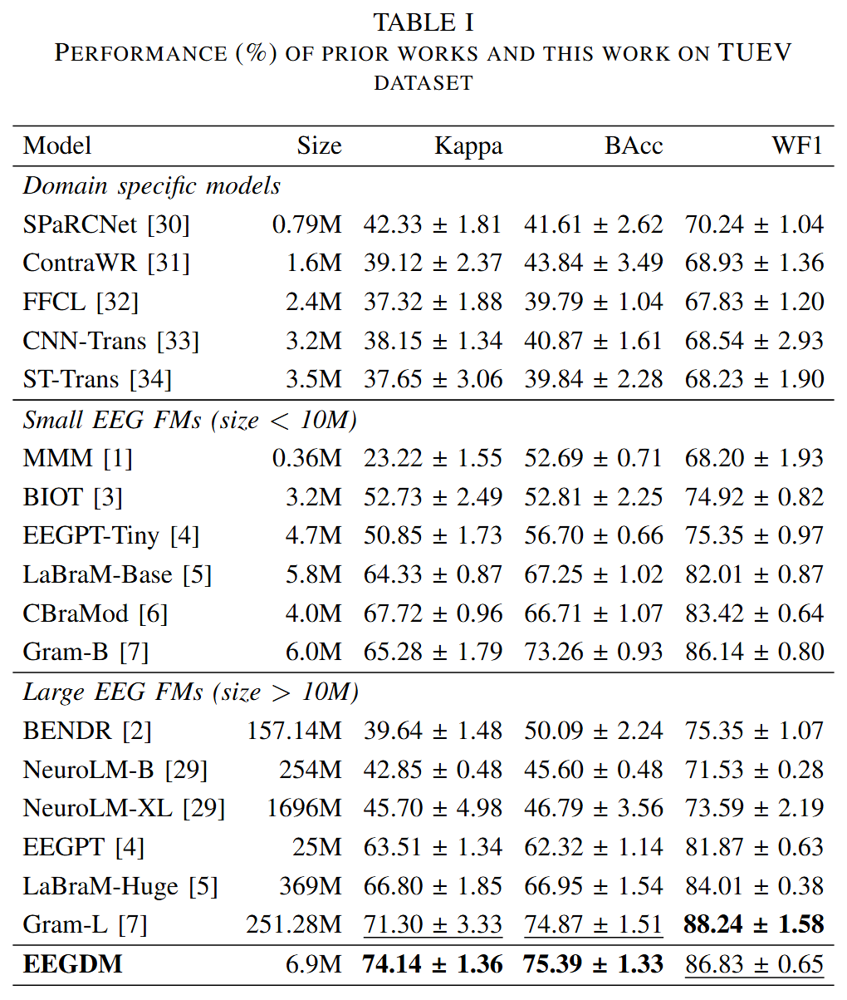
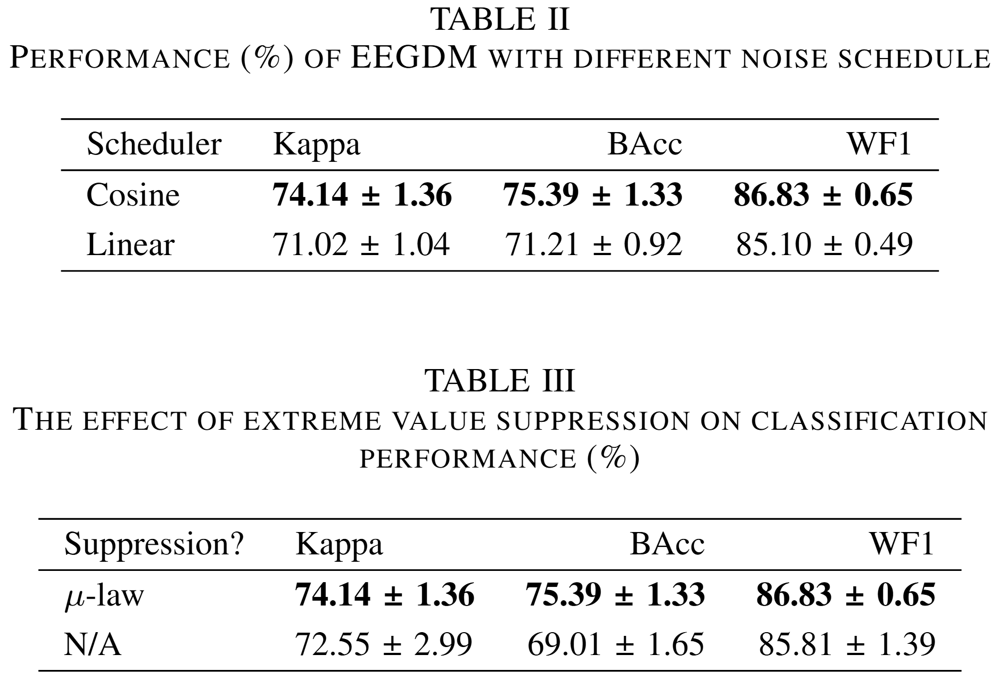
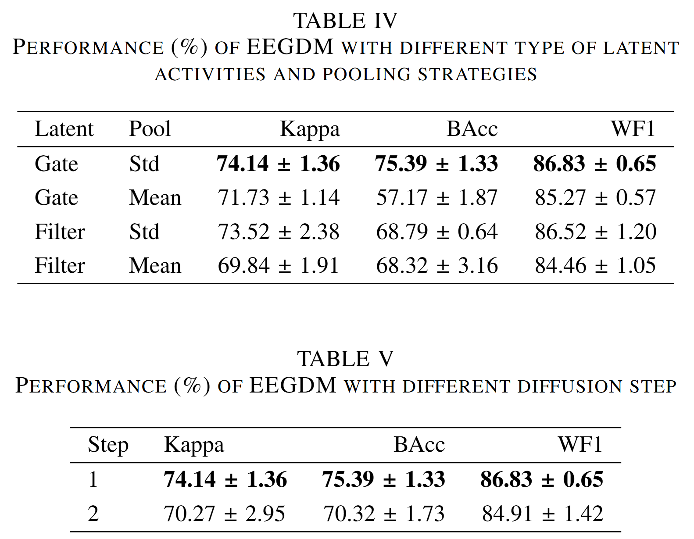

<div align="center">
<br>

<h3>EEG Diffusion Model</h3></div>

<p align="center">
  <a href="https://arxiv.org/abs/2505.15809">
    
  </a>
  <a href="https://huggingface.co/Gen-Verse/MMaDA-8B-Base">
    
  </a>


  
</p>

<div align="center">
<br>

</div>


## 🌌 Introduction

EEGDM is a novel EEG diffusion model designed for generating realistic EEG signals. This project aims to provide a framework for research and development in the field of EEG synthesis and analysis.

## 😮 Hightlights

• This work is one of the first (if not the first) to use diffusion models directly in the extraction of EEG signal representations, thus opening a new research direction.  
• This work empirically shows that self-supervised representation learning can be achieved through adding Gaussian noise in the time domain directly, offering apromising alternative to the tokenization-then-masking method.  
• The proposed method achieved performance exceeding previous domain-specific models, and matches large EEG JOURNAL OF LATEX CLASS FILES, VOL. 14, NO. 8, AUGUST 2015 2 FMs despite the disadvantages in training data size and model size.  

## Main result

<div align="center">
<br>

</div>

<div align="center">
<br>

</div>

<div align="center">
<br>

</div>

<div align="center">
<br>

</div>

## 📰 Latest Updates

*   **[2025-07-16]** Initial setup and README update.

## ⚙️ Quick Start

First, set up the environment:

```bash
conda create -n proper python=3.11
conda activate proper
pip install numpy==1.26.4 hydra-core mne torch torchvision torchaudio lightning pyhealth ema-pytorch diffusers einops wandb scipy pyhealth
```
or
```bash
pip install -r requirements.txt
```

### Usage Examples:

**Preprocessing:**
```bash
python main.py preprocessing=pretrain
```
Refering to preprocessing of LaBraM

**Pre-training:**
```bash
python main.py pretrain=base
```

**Caching:**
```bash
python main.py cache=base_t2
```

**Fine-tuning:**
```bash
python main.py finetune=base finetune.rng_seeding.seed=0
python main.py finetune=base_gatem finetune.rng_seeding.seed=0
python main.py finetune=base_filters finetune.rng_seeding.seed=0
python main.py finetune=base_filterm finetune.rng_seeding.seed=0
python main.py finetune=linear finetune.rng_seeding.seed=0
python main.py finetune=base_t2 finetune.rng_seeding.seed=0
python main.py finetune=nolaw finetune.rng_seeding.seed=0
python main.py finetune=noise finetune.rng_seeding.seed=0
```
All seeds need to be iterated from 0 to 4

**Reporting:**
```bash
python main.py report=base
```

## 📖 Citation

If you use this work, please cite:

```
@article{eegdm2025,
  title={EEGDM: A Novel EEG Diffusion Model},
  author={Your Name(s) Here},
  journal={Preprint},
  year={2025}
}
```

## 🤝 Acknowledgments

This work is inspired by and builds upon various open-source projects and research in diffusion models and EEG processing. We acknowledge the contributions of the communities behind PyTorch, Hugging Face Diffusers, MNE-Python, and other related libraries.

## 💬 Discussion and Collaboration

We welcome discussions and collaborations to improve EEGDM. Please feel free to open issues or pull requests on GitHub.


