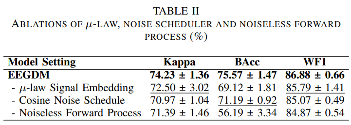
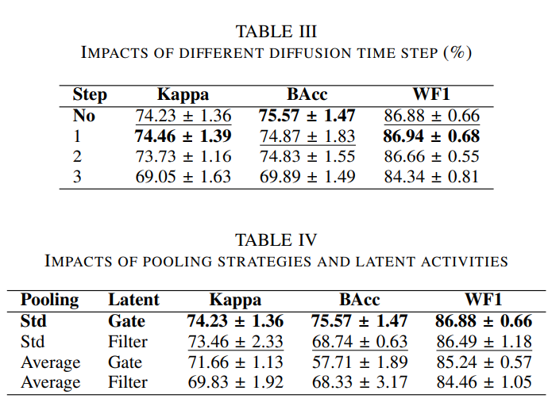
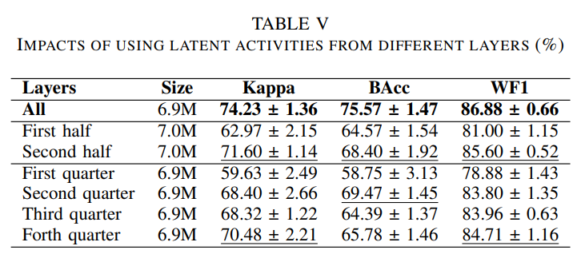
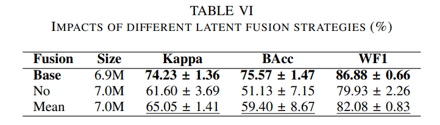
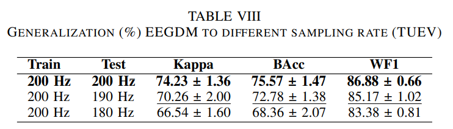

<div align="center">
<br>

<h2>EEGDM: EEG Representation Learning via Generative Diffusion Model</h2></div>

<p align="center">
  <a href="https://arxiv.org/abs/2508.14086">
    
  </a>
  <a href="https://huggingface.co/jhpuah/eegdm/tree/main">
    
  </a>
</p>

<h3 align="center"><a href="https://aimplifier.github.io/projects/eegdm/"> Project page here 🚀</a></h3>

<div align="center">
<br>


</div>

<div align="center">
<br>

</div>

<div align="center">
<br>

</div>


## 🌌 Introduction

Our EEGDM is a novel self-supervised diffusion model designed for superior EEG signal representation learning. Unlike traditional "tokenization-then-masking" approaches used in EEG foundation models, EEGDM leverages the power of diffusion models to achieve robust and meaningful representations through progressive noise corruption and denoising.

EEGDM is distinguished by three key innovations:

1. First Application of Diffusion Models for EEG Representation Learning: This work pioneers the use of diffusion models for extracting EEG signal representations rather than just signal generation and data augmentation, opening up a new research direction in neurological signal processing.
2. Structured State-Space Model Architecture (SSMDP): EEGDM introduces a specialized neural architecture based on structured state-space models specifically designed for diffusion pre-training, enabling better capture of the temporal dynamics inherent in EEG signals.
3. Latent Fusion Transformer for Downstream Tasks: The framework incorporates a novel latent fusion transformer (LFT) that effectively utilizes the learned diffusion representations for downstream classification tasks like seizure detection, addressing the challenge of translating generative representations to discriminative tasks.
The proposed method addresses critical limitations in current EEG analysis, including the difficulty of learning robust representations due to limited high-quality annotations and high signal variability across subjects and conditions, while potentially offering computational advantages over existing transformer-based EEG foundation models.

## 😮 Hightlights

• We presented EEGDM, a diffusion model-based framework for learning EEG signal representations and classification of multi-event EEG, extending difussion model beyond signal generation and data augmentation.

• We developed structured state-space model diffusion pretraining (SSMDP) to capture the temporal dynamics of EEG signals and trained it via the forward and reverse process of DDPM for representation learning.

• We proposed LFT to leverage and fuse the latent representations from SSMDP for downstream classification tasks.

• We empirically compared our method with current state-of-the-art approaches on multi-event dataset TUEV to show its competitiveness and provided a detailed ablation study to analyze its components.

## 📈 Main result

<div align="center">
<br>

</div>

## ✂️ Ablation

<div align="center">
<br>

</div>

<div align="center">
<br>

</div>

<div align="center">
<br>

</div>

<div align="center">
<br>

</div>

<div align="center">
<br>

</div>

## 🧠 Generation Sample

<div align="center">
<br>

</div>

## 📰 Latest Updates

*   **[2025-07-16]** Initial setup and README update.
*   **[2025-08-11]** Main pages and experiment result update.

## ⚙️ Quick Start

First, set up the environment with Conda: https://docs.conda.io/projects/conda/en/latest/user-guide/install/index.html

```bash
conda create -n eegdm python=3.11
conda activate eegdm
```
Then, install dependencies:
```bash
pip install -r requirements.txt
```
The `requirement.txt` file is exported directly from our working environment (NVIDIA GeForce RTX 4090, CUDA Version: 12.4), if your hardware is incompatible, do the following instead:

1. Install torch following the official guide: https://pytorch.org/get-started/locally/

2. Run:
```bash
pip install numpy==1.26.4 hydra-core mne lightning pyhealth ema-pytorch diffusers einops wandb scipy
```

We use Weight and Bias (https://wandb.ai/site/) for logging, and you will need an account for that. Alternatively, replace instances of `WandbLogger` to your own logger, check Pytorch Lightning documentation for available options: https://lightning.ai/docs/pytorch/stable/extensions/logging.html 


### Usage Examples:

```bash
python main.py [preprocessing=?] [pretrain=?] [cache=?] [finetune=?] [report=?] [extra=?]
```
Replace "?" with config file name (without extension).
The file must be put inside "conf", under the directory with the same name.

e.g.
```bash
python main.py pretrain=base
```
Run pretraining with config specified in `conf/pretrain/base.yaml`.

You can override config in command line, 
see Hydra documentation (https://hydra.cc/docs/intro/). E.g. 
```bash
python main.py finetune=base finetune.rng_seeding.seed=10
```
Run finetuning with config specified in `conf/finetune/base.yaml`, and set the rng seed to 10.


`extra` config is special: the function specified in its `target` field will be loaded,
and the config will be passed to that function. This is a quick and dirty way to add experiments that does not fit well to the established workflow.


### Experiments:
**Preprocessing:**


We follow the general preprocessing logic of LaBraM: https://github.com/935963004/LaBraM/blob/main/dataset_maker/make_TUEV.py

To produce single-channel EEG signal for diffusion model pretraining, run:
```bash
python main.py preprocessing=pretrain
```

To produce signal for finetuning, run:
```bash
python main.py preprocessing=faithful
```

**Pre-training:**

```bash
python main.py pretrain=?
```
Where `?` is `base`, `linear` or `nolaw`.

`base` uses cosine noise scheduler and perform mu-law based extreme value suppression. `linear` uses linear noise scheduler, and `nolaw` does not perform value suppression.

**Caching:**

If noise injection is disabled, the latent tokens can be cached to avoid repeated computation.

The test data is untouched during caching.

See `conf/cache` for available options.
```bash
python main.py cache=base
```

**Fine-tuning:**

<!-- Use `finetune.data_is_cached=<boolean>` to tell  -->

If data is cached, the code will check metadata to ensure that it is consistent with the model hyperparameter.

See `conf/finetune` for available options.

In our experiment, `finetune.rng_seeding.seed` is set to 0, 1, 2, 3 and 4 to produce 5 checkpoints

```bash
python main.py finetune=base finetune.rng_seeding.seed=0
```

**Reporting:**

If testing data cannot be distributed evenly across devices, certain data will be duplicated and cause inaccuracy in the reported metrics. Using `report` will avoid this issue.

`report` also calculate the mean and standard deviation of metrices of multiple checkpoints.
```bash
python main.py report=base
```

**Other**

Scripts of certain ablation experiments are put in `src/extra`:
```bash
python main.py extra=reduce_sampling extra.rate=0.95
python main.py extra=no_fusion extra.rng_seeding.seed=0
python main.py extra=report_no_fusion
python main.py extra=mean_fusion extra.rng_seeding.seed=0
python main.py extra=report_mean_fusion
```
All seeds need to be iterated from 0 to 4

<!-- ## Repo Structure
`main.py` is the entry point of this repo. 

`src/` contains the scripts for generic
`src/extra/` contains the scripts of extra... 

`model/`

`dataloader/`


`conf/`

Finally, `assets` contains images used in this README file.

During pretraining and finetuning, the scripts may create new directories:
* `data/`: training, validation, and testing data, if `cache` is used, cached latent will be put under `data/cached`

* `gen/`: EEG signal samples generated by SSMDP

* `checkpoint` contains model checkpoints of SSMDP and LFT.

Others are logs by dependencies (`lightning_logs` by Pytorch Lightning, `outputs` by Hydra, etc.).  -->


## ℹ️ Unused Code
This repo is still under active development, and left in several pieces of unused/untested code. Any functionality implied by the code but not mentioned in the paper shall be considered experimental. Documentation about these code (if any) might be outdated or unreliable.

## 📖 Citation

If you use this work, please cite:

```
@article{eegdm2025,
  title={EEGDM: A Novel EEG Diffusion Model},
  author={Your Name(s) Here},
  journal={Preprint},
  year={2025}
}
```

## 🤝 Acknowledgments

This work is inspired by and builds upon various open-source projects and research in diffusion models and EEG processing. We acknowledge the contributions of the communities behind PyTorch, Hugging Face Diffusers, MNE-Python, and other related libraries.

## 💬 Discussion and Collaboration

We welcome discussions and collaborations to improve EEGDM. Please feel free to open issues or pull requests on GitHub.


